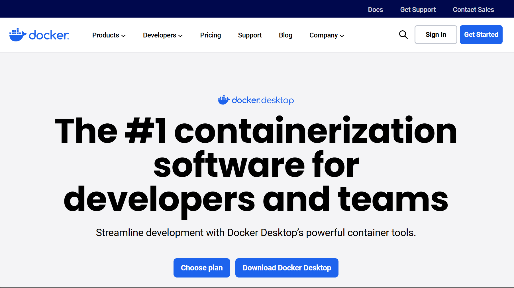
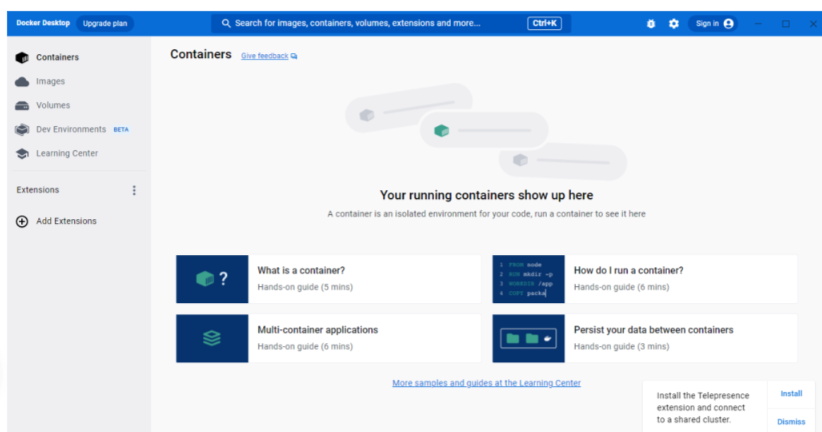
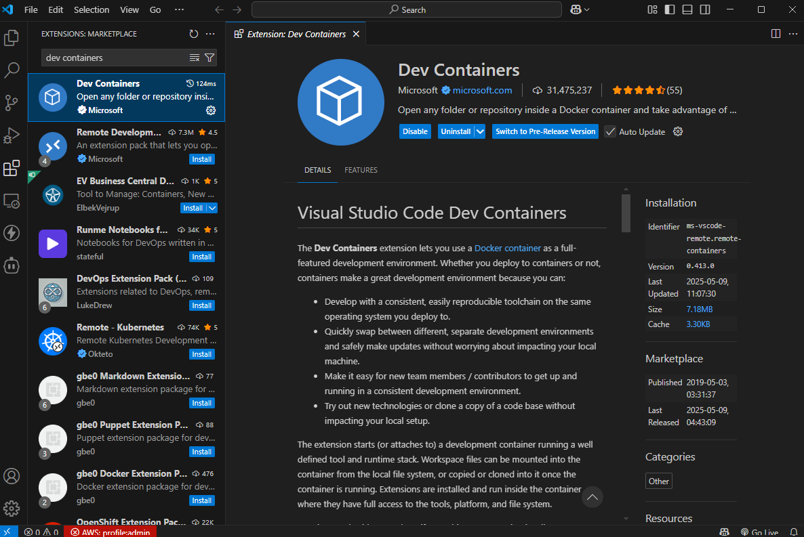

# Complete Beginner's Guide to Using the Nestle Project with Dev Containers

## What is This Project?
This is a project that helps deploy applications to the cloud (AWS). Think of it like preparing and packaging your application to run on powerful computers in the internet, rather than just your local machine.


## What are Dev Containers?

Think of a dev container as a pre-packed toolkit that:
- Has all the tools you need already installed
- Works the same way for everyone
- Keeps your computer clean and organized
- Prevents "it works on my machine" problems


### Why Use Dev Containers?

Benefits:
1. Everything's pre-installed
2. Same setup for everyone
3. No conflicts with other projects
4. Easy to start fresh if needed

## .NET Installation Note

You don't need to install .NET on your local machine because:
1. The dev container will include the required .NET SDK (version 8.0)
2. All .NET dependencies are managed within the container
3. The container ensures everyone uses the same .NET version

## Node.js Installation Note

You don't need to install Node.js locally because:
1. AWS CDK requires Node.js
2. The dev container includes the necessary Node.js version
3. All npm dependencies are managed within the container

## Setting Up Your Development Environment

### 1. Installing Required Tools

#### Visual Studio Code (VS Code)
This is where you'll write and edit your code.


*The VS Code website. Click the blue download button for your operating system.*

Steps:
1. Visit [Visual Studio Code](https://code.visualstudio.com/)
2. Click the big blue download button
3. Run the installer
4. Accept all default settings


*Make sure to select these important options during installation.*

#### Docker Desktop
This is what runs your dev container.


*The Docker Desktop download page. Click "Download for Windows/Mac".*

Steps:
1. Visit [Docker Desktop](https://www.docker.com/products/docker-desktop)
2. Download for your operating system
3. Run the installer
4. Start Docker Desktop after installation


*The Docker Desktop dashboard showing container status and settings.*

#### Dev Containers Extension
This lets VS Code use dev containers.


*Click the Extensions icon in the sidebar (or press Ctrl+Shift+X). 

Steps:
1. Open VS Code
2. Click Extensions icon (or press Ctrl+Shift+X)
3. Search for "Dev Containers"
4. Click Install


## Getting Started

### 1. Getting the Project Files

#### 1. Create Account on Github or Login to Github
1. Go to https://github.com
   
2. Click "Sign up"
3. Follow the registration process
4. Verify your email address

Clone the repository (get a copy of the project):
```bash
git clone https://github.com/your-username/your-repo.git
cd NestleProject
```

### 2. Opening in VS Code

Two ways to open:
1. Drag the folder into VS Code
2. Or use terminal command:
   ```bash
   cd your-repo
   code .
   ```

### 3. Starting the Dev Container

If you don't see the prompt:
1. Press F1 key
2. Type "Dev Containers: Reopen in Container"
3. Press Enter


What's happening behind the scenes:
1. Docker is creating your development environment
2. Installing all needed tools:
   - .NET SDK 8.0 for running C# code
   - Node.js and npm for AWS CDK
   - AWS CDK CLI for deployment
   - Setting up environment variables

## Understanding the Project Structure

Let's break down how the project is organized:


Key parts explained:
- `src/NestleProject/`: Contains the main code that sets up your AWS infrastructure
- `src/NestleProject.Lambda/`: Contains the function that runs in AWS
- `src/NestleProject.Lambda.Publisher/`: Contains code for sending messages

## Development Workflow

Here's how to work with the project:

### 1. Opening the Terminal
Press Ctrl + ` (backtick key) to open VS Code's terminal

### 2. Building the Project
This compiles your code to make sure everything works:

```bash
cd NestleProject
dotnet build
```

### 3. First-Time Setup
When deploying for the first time:


```bash
# Set up AWS for first use
cdk bootstrap

# Deploy your code
cdk deploy
```

### 4. Making Changes
When you want to modify the project:


Where to make changes:
- Lambda functions → `src/NestleProject.Lambda/`
- Infrastructure → `src/NestleProject/`
- Publisher code → `src/NestleProject.Lambda.Publisher/`

## Common Development Tasks

Here are the main commands you'll use while working on the project:

### Building Your Code
Think of this like compiling your code to make sure it works:


```bash
dotnet build  # Builds the entire project
```

### AWS CDK Commands
Commands for managing your AWS infrastructure:


```bash
# See what will be deployed
cdk diff

# Deploy your changes
cdk deploy

# Remove everything (be careful!)
cdk destroy
```

## Troubleshooting Common Issues

### 1. Container Problems
If your dev container won't start:


Steps to fix:
1. Check Docker Desktop is running
2. Press F1 in VS Code
3. Type "Dev Containers: Rebuild Container"

### 2. Build Problems
If your code won't build:


Steps to fix:
```bash
# Clean the project
dotnet clean

# Restore packages
dotnet restore

# Try building again
dotnet build
```

### 3. AWS/CDK Problems
If you have issues with AWS:


Steps to fix:
1. Configure AWS:
   ```bash
   aws configure
   ```
2. Check CDK version:
   ```bash
   cdk --version
   ```

## Need Help?

- Check the [.NET documentation](https://docs.microsoft.com/en-us/dotnet/)
- Visit [AWS CDK documentation](https://docs.aws.amazon.com/cdk/)
- Review [Dev Containers documentation](https://code.visualstudio.com/docs/remote/containers)
