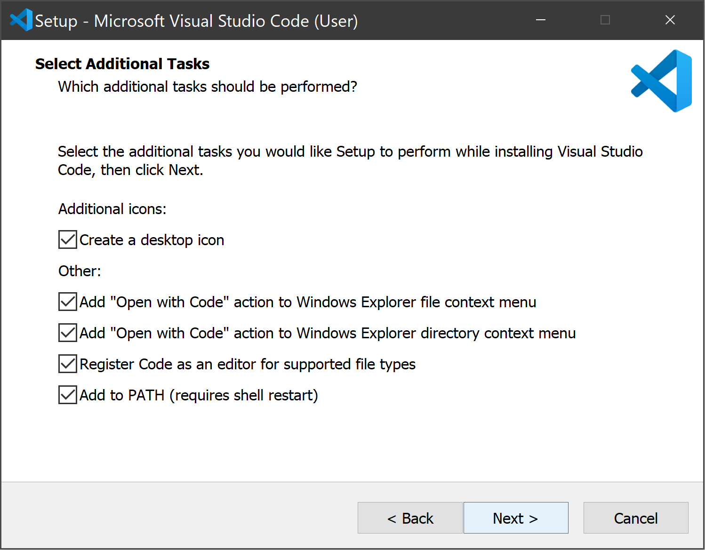
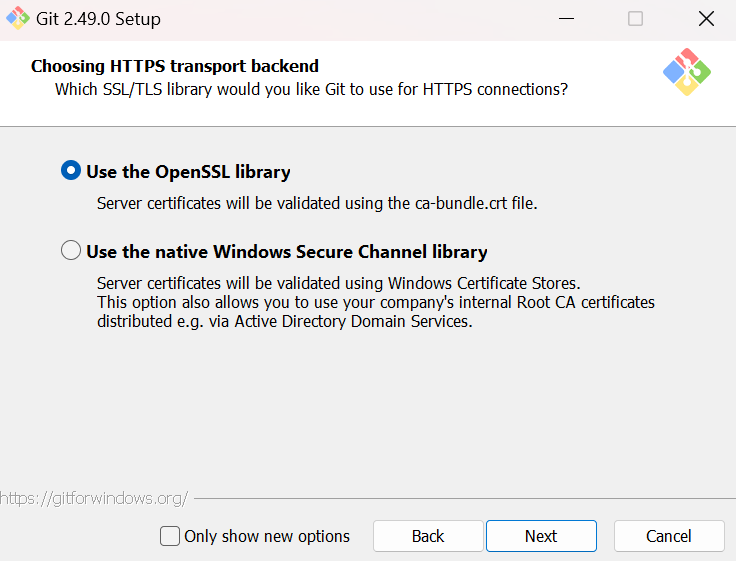

# Setting Up a Development Container Environment: A Complete Beginner's Guide

## Table of Contents
1. [What is a Development Container?](#what-is-a-development-container)
2. [Prerequisites](#prerequisites)
3. [Step-by-Step Installation Guide](#step-by-step-installation-guide)
4. [Creating Your First Dev Container](#creating-your-first-dev-container)
5. [Common Issues and Troubleshooting](#common-issues-and-troubleshooting)
6. [Git Integration](#git-integration)
7. [Best Practices](#best-practices)

## What is a Development Container?

A development container (or dev container) is like a pre-configured, isolated workspace for your project. Imagine having a fresh, clean computer setup every time you start working, with all the tools you need already installed and configured. That's what a dev container does!


## Prerequisites

Before we begin, you'll need to install these essential tools:

1. **Visual Studio Code (VS Code)**
   - Download from: https://code.visualstudio.com
   - Why: This is your main editor where you'll write code

2. **Docker Desktop**
   - Download from: https://www.docker.com/products/docker-desktop
   - Why: This runs your development containers

3. **Git**
   - Download from: https://git-scm.com
   - Why: For version control and code sharing


## Step-by-Step Installation Guide

### 1. Installing Visual Studio Code

#### Download and Installation
1. Go to https://code.visualstudio.com


*The VS Code website. Click the blue download button for your operating system.*

2. Run the installer and select the following options:


*Make sure to select these important options during installation.*

3. After installation, open VS Code. You'll see this welcome screen:


*The VS Code welcome screen with quick links and getting started guides.*

4. The key parts of VS Code interface:
```
  1. Activity Bar (left)
  2. Side Bar (file explorer, search, etc.)
  3. Editor Area
  4. Panel (terminal, output, etc.)
  5. Status Bar (bottom)
```

5. Opening the Command Palette (Ctrl+Shift+P):


*The Command Palette is your main interface for executing VS Code commands.*

### 2. Installing Docker Desktop

#### Download and Setup
1. Visit https://www.docker.com/products/docker-desktop


*The Docker Desktop download page. Click "Download for Windows/Mac".*

2. Run the installer and follow the prompts:


*The Docker Desktop installer with WSL 2 option for Windows users.*

3. After installation, you'll see the Docker Desktop dashboard:


*The Docker Desktop dashboard showing container status and settings.*

4. Verify installation in terminal:


*Running `docker --version` in the terminal to verify installation.*

5. Verify installation in terminal:


*Running `docker --version` in the terminal to verify installation.*

### 3. Installing Git

#### Download and Configuration
1. Visit https://git-scm.com


*The Git website. Click "Download for Windows/Mac". On the next page, select Standalone Installer x64 Setup.*

2. Run the installer with these recommended settings:


*Keep everything default.*


*Select VS Code as your default editor.*


*Choose to "Let Git Decide".*


*Choose to use Git from the command line and standalone tools.*



*Use the built-in OpenSSL library for HTTPS.*


*Configure line ending conversions. After this option, leave everything as default.*

3. Verify Git installation in terminal:


*Running `git --version` in the terminal to verify installation.*

## Creating Your First Dev Container

1. Open VS Code
2. Install the required VS Code extensions:


*Click the Extensions icon in the sidebar (or press Ctrl+Shift+X). 
Search for "Dev Containers" and click Install*
   
   The Dev Containers extension allows you to:
   - Open any folder inside a container
   - Automatically build dev container images
   - Use preconfigured container definitions
   - Add your own custom container configuration
   - Connect to existing containers

3. Understanding Dev Containers Extension Features:
   - **Command Palette Actions** (Press F1 or Ctrl+Shift+P):
     * "Dev Containers: Open Folder in Container..."
     * "Dev Containers: Add Dev Container Configuration Files..."
     * "Dev Containers: Rebuild Container"
     * "Dev Containers: Reopen in Container"
   
   - **Predefined Container Definitions**:
     * Choose from many predefined development container definitions
     * Languages support: Python, Node.js, Java, .NET, PHP, etc.
     * Frameworks support: React, Angular, Vue, Django, Flask, etc.
     * Database support: PostgreSQL, MySQL, MongoDB, etc.

   - **Custom Configuration**:
     * Modify devcontainer.json to:
       - Specify base image
       - Install additional tools
       - Configure environment variables
       - Set up port forwarding
       - Mount volumes
       - Add extensions

4. Using Dev Containers:
   ```json
   // Example devcontainer.json
   {
     "name": "My Project",
     "image": "mcr.microsoft.com/devcontainers/javascript-node:0-18",
     "customizations": {
       "vscode": {
         "extensions": [
           "dbaeumer.vscode-eslint",
           "esbenp.prettier-vscode"
         ]
       }
     },
     "forwardPorts": [3000],
     "postCreateCommand": "npm install"
   }
   ```


5. Create a new folder for your project
6. Open the folder in VS Code
7. Press `F1` or `Ctrl+Shift+P` to open the Command Palette
8. Type "Dev Containers: Add Dev Container Configuration Files..."
9. Select your project type (e.g., Python, Node.js, etc.)
10. Choose additional features to install (e.g., Git, specific tools)
11. VS Code will create two files:
    - `.devcontainer/devcontainer.json`: Container configuration
    - `.devcontainer/Dockerfile`: Container image definition

12. After files are created:
    - VS Code will prompt to "Reopen in Container"
    - Click this to build and start your dev container
    - Wait for the container to build (first time may take a few minutes)
    - You're now working inside the container!

13. Customizing Your Dev Container:
    - Open `.devcontainer/devcontainer.json`
    - Common customizations:
    ```json
    {
      "name": "Your Project Name",
      // Base image or Dockerfile
      "build": {
        "dockerfile": "Dockerfile"
      },
      // Install additional VS Code extensions
      "customizations": {
        "vscode": {
          "extensions": [
            "ms-python.python",
            "ms-azuretools.vscode-docker"
          ]
        }
      },
      // Forward ports from container
      "forwardPorts": [3000, 8080],
      // Run commands after container is created
      "postCreateCommand": "npm install",
      // Add environment variables
      "remoteEnv": {
        "DATABASE_URL": "postgresql://localhost:5432/mydb"
      }
    }
    ```

## Common Issues and Troubleshooting

### Docker Issues


#### Problem: Docker not starting
- **Solution 1:** Ensure Virtualization is enabled in BIOS
- **Solution 2:** For Windows, ensure WSL 2 is properly installed
- **Solution 3:** Restart Docker Desktop

#### Problem: Permission denied
- **Solution 1:** Start Docker Desktop as administrator
- **Solution 2:** Add your user to the docker-users group

### VS Code Issues

#### Problem: Can't find Dev Containers extension
- **Solution:** Check internet connection and refresh VS Code

#### Problem: Container won't build
1. Check Docker Desktop is running
2. Try rebuilding container: `Ctrl+Shift+P` → "Rebuild Container"
3. Check .devcontainer/devcontainer.json for errors

## Git and GitHub Integration

### Understanding Git and GitHub for Beginners

#### What is Git?
Git is a version control system that runs on your computer. Think of it as a sophisticated "Save As" system that:
- Tracks every change you make to your files
- Lets you review and undo changes
- Works completely offline
- Helps manage different versions of your code

#### What is GitHub?
GitHub is a website service that:
- Hosts Git repositories online
- Makes it easy to share your code
- Allows multiple people to work on the same code
- Provides tools for code review and project management

The relationship: Git is the tool, GitHub is the service that hosts Git projects online.

### Step-by-Step Setup Guide

#### 1. Initial Git Setup (One-time setup)
1. Open terminal in VS Code (Ctrl + `)
2. Configure your identity:
   ```bash
   # Set your name
   git config --global user.name "Your Name"
   
   # Set your email (use the same email as your GitHub account)
   git config --global user.email "your.email@example.com"
   ```

#### 2. GitHub Account Setup (One-time setup)
1. Go to https://github.com
   
2. Click "Sign up"
3. Follow the registration process
4. Verify your email address

#### 3. Setting Up a New Project with Git
1. Create and enter your project folder
2. Initialize Git in your project:
   ```bash
   # This creates a new Git repository
   git init
   
   # Verify it worked - you should see a hidden .git folder
   dir /a   # on Windows
   ls -la   # on Mac/Linux
   ```

3. Create a .gitignore file (tells Git which files to ignore):
   ```bash
   # Common files to ignore
   .env                # Environment variables
   node_modules/       # Node.js dependencies
   __pycache__/       # Python cache
   .vscode/           # VS Code settings
   *.log              # Log files
   .DS_Store          # Mac system files
   ```

#### 4. Creating Your First Local Save (Commit)
1. Stage your files (prepare them for saving):
   ```bash
   # See which files Git detected
   git status
   
   # Add all files
   git add .
   
   # Or add specific files
   git add filename.txt
   
   # Check status again to verify
   git status
   ```

2. Save your changes (commit):
   ```bash
   git commit -m "Initial commit: Project setup"
   ```

#### 5. Connecting to GitHub
1. Create a new repository on GitHub:
   - Go to https://github.com
   - Click the "+" in the top-right corner
   - Select "New repository"
   
   *Select "New repository" from the menu*

   - Fill in your repository details:
     * Name your repository
     * Add an optional description
     * Choose public or private
     * DO NOT initialize with README (we'll upload our existing code)
   
   *Fill in the repository details. Leave "Add a README file" unchecked if you have existing code*

   - Click "Create repository"
   - You'll see the quick setup page with commands to use:
   
   *The quick setup page shows the commands you'll need to run*

2. Connect your local Git to GitHub:
   ```bash
   # GitHub will show these commands after repository creation
   
   # Set the main branch name
   git branch -M main
   
   # Link your local repo to GitHub (GitHub will show the exact URL)
   git remote add origin https://github.com/yourusername/your-repo-name.git
   
   # Verify the remote connection
   git remote -v
   ```
   
   *You should see something like this after running these commands.*

#### 6. Pushing Changes to GitHub
1. Push your code to GitHub for the first time:
   ```bash
   # The -u flag remembers your preferences for future pushes
   git push -u origin main
   ```
    
    *You should see something like this after git push.*

2. Verify on `github.com`
  
  *You should see your github repository having same files you pushed.*

2. Future changes workflow:
   ```bash
   # 1. Check what's changed
   git status
   
   # 2. Stage changes
   git add .
   
   # 3. Save changes locally
   git commit -m "Describe what you changed"
   
   # 4. Upload to GitHub
   git push
   ```

### Common Git Commands Reference
```bash
# Check repository status
git status

# See change history
git log

# Create and switch to a new branch
git checkout -b branch-name

# Switch branches
git checkout branch-name

# Download updates from GitHub
git pull

# See what changed in a file
git diff filename
```

### Visualizing Git Workflow


### Tips for Beginners
1. Use `git status` frequently to see what's happening
2. Make small, focused commits with clear messages
3. Pull changes before starting new work
4. Always check which branch you're on
5. Create a new branch for new features/changes

### Need Help?
- Run `git --help` for command list
- Run `git command --help` for specific command help
- Visit [GitHub Guides](https://guides.github.com) for tutorials

## Best Practices

1. **Always create a `.devcontainer` folder** in your project root
2. **Document your container setup** in README.md
3. **Use version control** from the start
4. **Keep containers lightweight** - only install what you need
5. **Test container builds regularly** to ensure reproducibility
6. **Share your dev container configuration** with team members

### folder Structure Example:
```
your-project/
├── .devcontainer/
│   ├── devcontainer.json
│   └── Dockerfile
├── .gitignore
├── README.md
└── src/
    └── your-code-files
```

Remember: Development containers help ensure consistent development environments across team members and reduce the "it works on my machine" problem!

## Terminal Setup and Usage

The terminal is a crucial tool for working with dev containers. Here's how to use it effectively in VS Code:

1. Opening the Integrated Terminal:


*Press Ctrl+` or go to View > Terminal to open the integrated terminal*

2. Terminal in Dev Container:
  When inside a dev container, the terminal runs inside the container environment

3. Common Terminal Commands:


*Example of running common commands in the terminal: "cd" and "ls"*

### Need Help?
- Check the [VS Code Dev Containers documentation](https://code.visualstudio.com/docs/devcontainers/containers)
- Visit the [Docker documentation](https://docs.docker.com)
- Ask questions on [Stack Overflow](https://stackoverflow.com) with tags: `docker` `visual-studio-code` `devcontainers`

### Note About Images
All images in this guide are included to help you easily identify where to click and what to look for during setup. If the UI looks slightly different on your system (due to updates or different OS), the general locations and names of items should remain similar.
